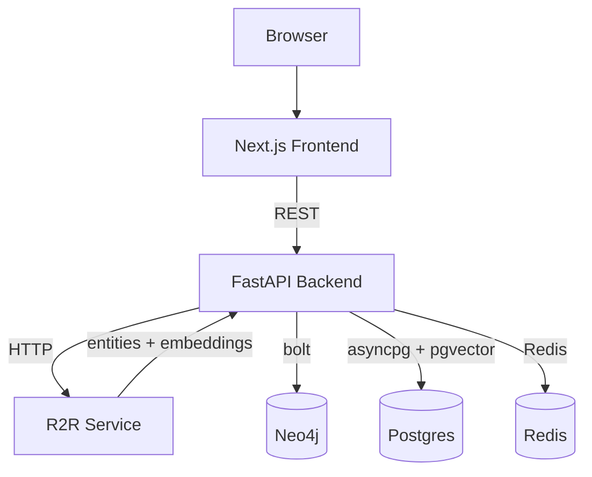
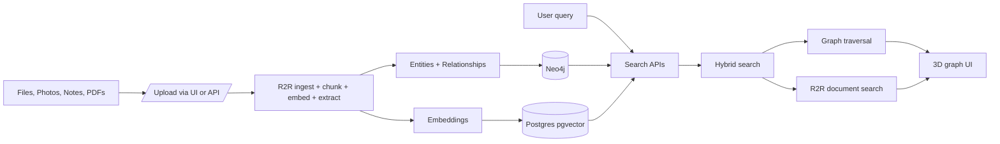

# graphaura

Bring your memories back to life with GraphAura. Transform photos and docs into an AI-powered 3D knowledge graph of people, places, and moments to explore your memories and share insights.

## Repositories

- graphaura: this monorepo with frontend and backend
- R2R: external service for ingestion, chunking, embeddings, and RAG

## Tech stack

- Frontend: Next.js 15, React 19, Tailwind CSS, react-force-graph-3d
- Backend: FastAPI (Python 3.13), structlog
- Data: Neo4j, PostgreSQL + pgvector, Redis
- AI: R2R for ingestion, NER, embeddings, and RAG

## Architecture



## Data flow



## Monorepo layout

```text
graphaura/
  backend/        FastAPI app, services, and APIs
  frontend/       Next.js app with 3D graph visualization
```

## Quick start (dev)

1. Dependencies
   - Neo4j 5 running locally
   - Postgres with pgvector extension
   - Redis
   - R2R service available at `http://localhost:7272`

2. Backend
   - `cd backend`
   - `uv sync`
   - copy `.env.example` to `.env` and set connection strings
   - `uv run uvicorn src.main:app --reload`

3. Frontend
   - `cd frontend`
   - `npm install`
   - `npm run dev`

## Key endpoints

- `GET /health` - service health
- `GET /metrics` - vector and graph counts
- `POST /api/v1/documents/upload` - upload and process document via R2R
- `GET /api/v1/documents/{id}` - document metadata
- `POST /api/v1/documents/create-graph` - build graph from documents
- `POST /api/v1/graph/entities` - create entity
- `GET /api/v1/graph/entities/{id}` - fetch entity and relationships
- `POST /api/v1/search/hybrid` - hybrid search across documents and graph

## Configuration

Set via environment variables (see `backend/.env.example` and `backend/src/config.py`). Common keys:

- `POSTGRES_*` - Postgres connection and database name
- `NEO4J_*` - Neo4j connection
- `R2R_BASE_URL` - R2R base URL
- `REDIS_*` - Redis connection
- `VECTOR_DIMENSION`, `SIMILARITY_THRESHOLD`, `MAX_GRAPH_DEPTH`

## Notes

- See `backend/README.md` for detailed APIs and development commands.
- Frontend runs on `http://localhost:3000`. Backend runs on `http://localhost:8000` with OpenAPI docs at `/docs`.
