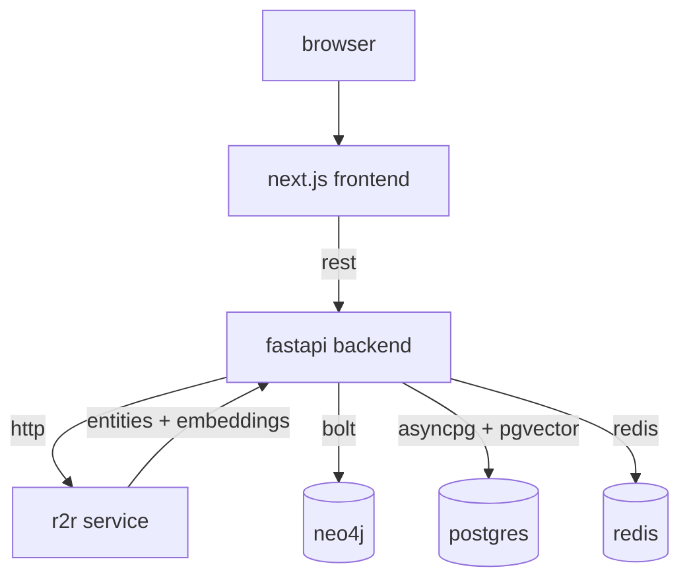
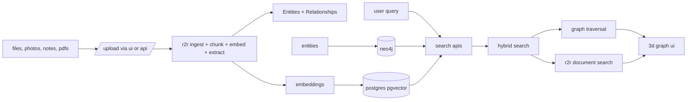

# graphaura

bring your memories back to life with graphaura. transform photos and docs into an ai-powered 3d knowledge graph of people, places, and moments to explore your memories and share insights.


## repos

- graphaura: this monorepo with frontend and backend
- r2r: external service for ingestion, chunking, embeddings, and RAG

## tech stack

- frontend: next.js, react, tailwind css, react-force-graph-3d
- backend: fastapi (python 3.13), structlog
- data: neo4j, postgresql + pgvector, redis
- ai: r2r for ingestion, NER, embeddings, and RAG

## architecture



## data flow



## monorepo layout

```text
graphaura/
  backend/        fastapi app, services, and apis
  frontend/       next.js app with 3d graph visualization
```

## key endpoints

- `GET /health` - service health
- `GET /metrics` - vector and graph counts
- `POST /api/v1/documents/upload` - upload and process document via r2r
- `GET /api/v1/documents/{id}` - document metadata
- `POST /api/v1/documents/create-graph` - build graph from documents
- `POST /api/v1/graph/entities` - create entity
- `GET /api/v1/graph/entities/{id}` - fetch entity and relationships
- `POST /api/v1/search/hybrid` - hybrid search across documents and graph
